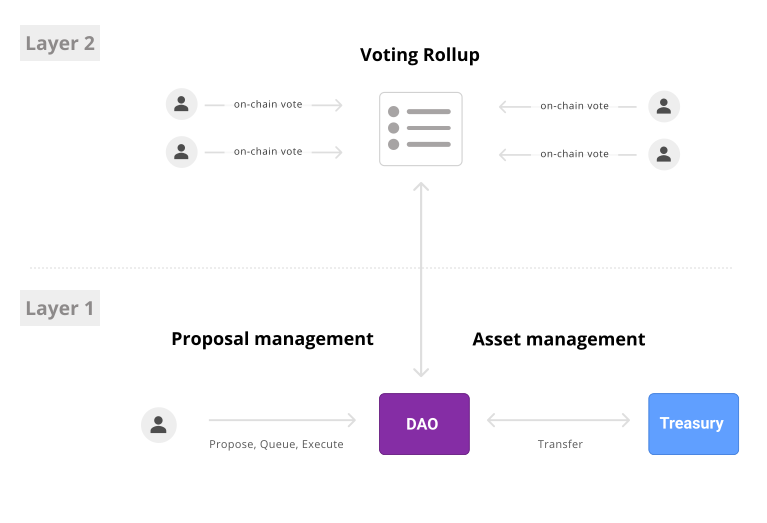
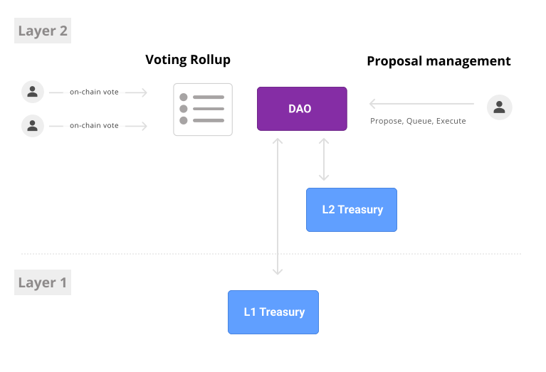

# RollCall: Rollup Governance Libraries

RollCall is a set of cross chain governance solutions

- **L2Voter**: Voting on mainnet governance proposals on a rollup.
- **Executor**: Manage mainnet treasury from a governance on a rollup.

## Quickstart

Install foundry
https://github.com/gakonst/foundry#installation

Run tests

```
forge test --vvv
```

## L2Voter



Voting on Ethereum mainnet (Layer 1) governance proposals on an Optimistic Rollups (Layer 2). We move only the voting to Layer 2.

To do so, Layer 1 governance's implementation provides a set of weight mappings (`mapping(address => uint256)`) which are used to compute a voters weight. When a proposal is created, the storage root of the block is bridged to Layer 2 and voters can submit votes on Layer 2 using storage proofs.

### Goals

1. Reduce the overhead for participating in governance by reducing voting gas costs
2. Enable onchain governance for tokens which do not already support the snapshot functionality.
3. Provide a modular framework for governance voting, where vote weights can be pulled from one or more sources and is not limited to token voting exclusively.

### Sequence Diagram

```
┌──────┐                                          ┌──────────┐     ┌────────┐
│Client│                                          │L1Governor│     │L2 Voter│
└──┬───┘                                          └───┬──────┘     └────────┘
   │                                                  │                 │
   │ propose(...)                                     │                 │
   ├─────────────────────────────────────────────────►│                 │
   │                                                  │                 │
   │                                                  │ bridge proposal │
   │                                                  │────────────────►│
   │                                                  │                 │
   │ activate (proposal id, blockheaders)             │                 │
   ├──────────────────────────────────────────────────┼────────────────►│
   │                                                  │                 │
   │                                                  │                 │
   │ vote (proposal id, storage proof, support)       │                 │
   ├──────────────────────────────────────────────────┼────────────────►│
   │                                                  │                 │
   │                                                  │                 │
   │ queue (proposal id)                              │                 │
   ├──────────────────────────────────────────────────┼────────────────►│
   │                                                  │                 │
   │                                                  │  bridge votes   │
   │                                                  │◄────────────────│
   │                                                  │                 │
   │ execute(proposal id)                             │                 │
   ├─────────────────────────────────────────────────►│                 │
   │                                                  │                 │
```

### Deployment

Deploy Bridge and RollCallGovernor

```bash
ROLLCALL_MAINNET=0 \
ROLLCALL_SOURCES=[0x781B575CA559263eb232B854195D6dC0AB720105] \
ROLLCALL_SLOTS=[0x0000000000000000000000000000000000000000000000000000000000000000] \
./scripts/deploy-voter-base.sh --rpc-url ...
```

Deploy L2Voter to Optimism

```
> ./scripts/deploy-voter-rollup.sh --rpc-url ...
...
ROLLCALL_BRIDGE=<0xADDRESS FROM ABOVE> L2Voter deployed to: 0x1ea2030f42718790adbd2a9448ea6ae2c6e2b06e
```

### Generating Storage Proofs

Install [Golang](https://go.dev/doc/install).

Run the generate script with the desired contract, voter address, and mapping storage slot

```
go run src/test/data/generate.go -contract 0x7ae1d57b58fa6411f32948314badd83583ee0e8c -voter 0xba740c9035fF3c24A69e0df231149c9cd12BAe07 -slot 0
```

## Executor



Manage Ethereum mainnet (Layer 1) treasury from a governance on an Optimistic Rollups (Layer 2). We move the DAO, minus the treasury, to Layer 2.

### Goals

1. Provide path for incremental migration of DAO Governance from Layer 1 to Layer 2.

### Sequence Diagram

```
┌──────┐                                         ┌──────────┐     ┌───────────┐
│Client│                                         │L2Governor│     │L1 Executor│
└──┬───┘                                         └────┬─────┘     └───────────┘
   │                                                  │                 │
   │ propose(...)                                     │                 │
   ├─────────────────────────────────────────────────►│                 │
   │                                                  │                 │
   │ vote (...)                                       │                 │
   ├─────────────────────────────────────────────────►│                 │
   │                                                  │                 │
   │ queue (...)                                      │                 │
   ├─────────────────────────────────────────────────►│                 │
   │                                                  │                 │
   │ execute(...)                                     │                 │
   ├─────────────────────────────────────────────────►│                 │
   │                                                  │                 │
   │                                                  │ bridge execute  │
   │                                                  │────────────────►│
```

### Disclaimer

_These smart contracts are being provided as is. No guarantee, representation or warranty is being made, express or implied, as to the safety or correctness of the user interface or the smart contracts. They have not been audited and as such there can be no assurance they will work as intended, and users may experience delays, failures, errors, omissions, loss of transmitted information or loss of funds. Paradigm is not liable for any of the foregoing. Users should proceed with caution and use at their own risk._